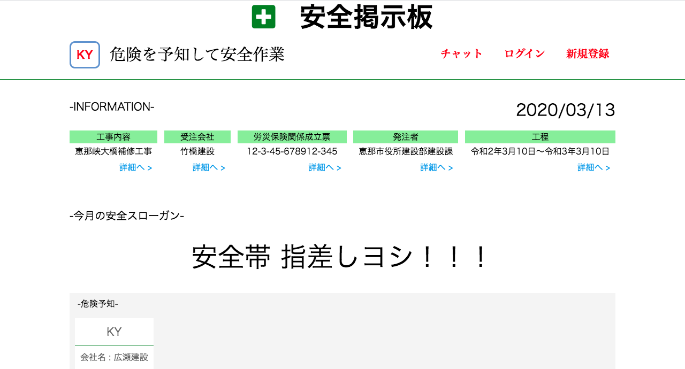
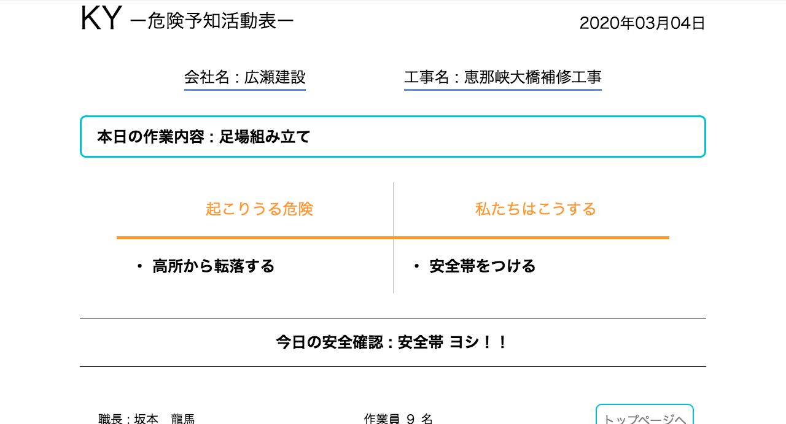

<h1 align="center"> 簡易安全掲示板（建設現場）</h3>

建設現場に設置される安全掲示板を見ることができる  
  

  
#### 建設現場に張り出される安全掲示板とは 
- KY（危険予知）活動と言われる活動があり、その活動内容をKY活動表と言われる書類に書き、張り出す場所  
- 現場に関する様々な情報が掲載されている    
##### KY活動表 

  
##### 現登録ユーザー（試用）
ID：  
PW：
  
##  APP URL  
https://ky-kentai.herokuapp.com/  
  
  
## 今後  
- 新規入場書類提出  
- その他現場関連書類の種類別提出  
- タイムカード  
- 下請け会社情報管理  
- 職人情報管理  
- チャット機能  
- 現場内、全員の健康管理  
  
#### 建設現場に特化した総合的な勤怠アプリを目指します。  
特徴として  
- 現場で提出する書類の紙レス化  
- PCやタブレット、スマホなどから書類作成
- 安全掲示板を誰でも見れる  
- 下請け会社や職人の管理がしやすい（資格や健康診断などの詳細を含んだ新規入場や日報など）
  
## Author
- [GitHub](https://github.com/Take-Hiro-Masa)
